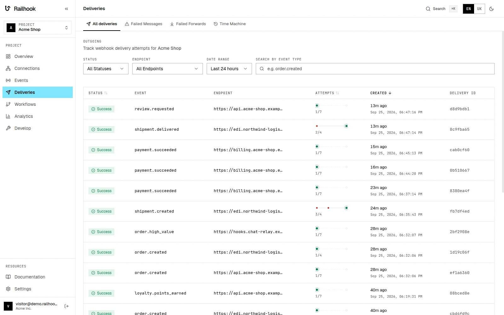
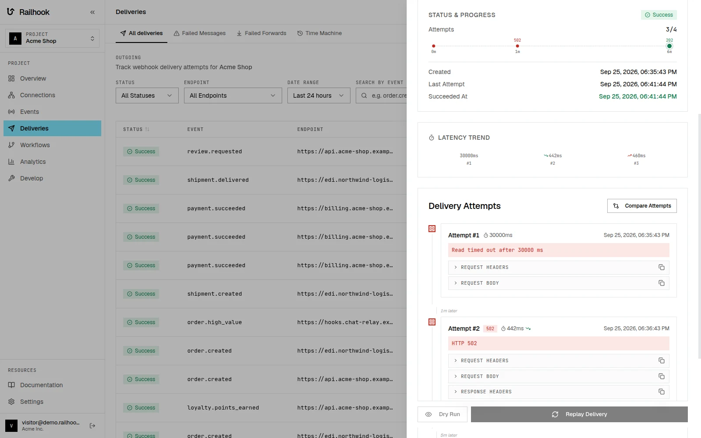
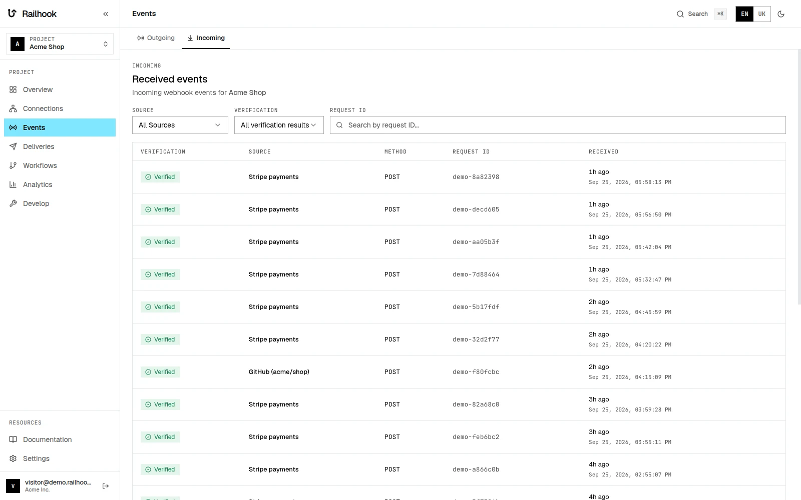

<div align="center">

<picture>
  <source media="(prefers-color-scheme: dark)" srcset="docs/brand/railhook-logo-dark.svg">
  
</picture>

**Self-hosted, open-source webhook gateway — send webhooks to your customers and receive them
from any provider, with every delivery on record.**

[](https://github.com/vadymkykalo/railhook/releases/latest)
[](https://github.com/vadymkykalo/railhook/actions/workflows/ci.yml)
[](./LICENSE)
[](https://github.com/vadymkykalo?tab=packages&repo_name=railhook)

<a href="https://www.saashub.com/railhook?utm_source=badge&utm_campaign=badge&utm_content=railhook&badge_variant=color&badge_kind=approved"></a>

[Website](https://railhook.io) · [Docs](https://railhook.io/docs/) ·
[API reference](https://railhook.io/docs/api-reference/) · [Railhook Cloud](https://railhook.io/register) · [Changelog](./CHANGELOG.md)






</div>

## Install

With Docker and Compose v2 (about 4 GiB of RAM):

```bash
mkdir railhook && cd railhook
curl -fsSLO https://raw.githubusercontent.com/vadymkykalo/railhook/main/docker-compose.yml
curl -fsSL https://raw.githubusercontent.com/vadymkykalo/railhook/main/.env.dist -o .env
# Replace the example secrets with your own, and turn on the bundled Postgres.
for v in WEBHOOK_ENCRYPTION_KEY WEBHOOK_ENCRYPTION_SALT JWT_SECRET REDIS_PASSWORD; do
  sed -i "s|^$v=.*|$v=$(openssl rand -hex 32)|" .env
done
db=$(openssl rand -hex 24)
sed -i "s|^POSTGRES_PASSWORD=.*|POSTGRES_PASSWORD=$db|; s|^DB_PASSWORD=.*|DB_PASSWORD=$db|" .env
echo "COMPOSE_PROFILES=embedded-db" >> .env
docker compose up -d
```

Open http://localhost:8080 and register. The first account is active immediately.

Or run the installer. It does the same, pins the latest release and adds a `./railhook` helper
(`status`, `logs`, `upgrade`, `backup`, `doctor`):

```bash
curl -fsSL https://railhook.io/install.sh | bash
# on a server with a domain, with HTTPS:
curl -fsSL https://railhook.io/install.sh | bash -s -- --domain hooks.example.com --email ops@example.com
```

## Send an event

Create a project, an endpoint and an API key in the UI, then:

```bash
curl -X POST http://localhost:8080/api/v1/events \
  -H "X-API-Key: $RAILHOOK_API_KEY" \
  -H "Idempotency-Key: order-12345-completed" \
  -H "Content-Type: application/json" \
  -d '{"type":"order.completed","data":{"orderId":"ord_12345"}}'
```

## What it does

- Sends each event to every endpoint subscribed to its type. The event is stored in the same
  transaction as the API call, then delivered through Kafka.
- Retries a failed delivery after 1m, 5m, 15m, 1h, 6h and 24h (7 attempts). What still fails
  goes to Failed Messages for bulk retry.
- Signs every request with HMAC-SHA256 in [Standard Webhooks](https://github.com/standard-webhooks/standard-webhooks)
  headers. A rotated secret keeps signing alongside the new one for 24 hours.
- Deduplicates on `Idempotency-Key`: a repeated key returns the first event instead of a new one.
- Optional per-endpoint ordering, rate limits and a circuit breaker.
- Customer portal: embed a page where your customers add endpoints, pick event types, and see and
  retry their deliveries.
- Replay: resend one delivery, or replay a time range of events as new deliveries.
- Incoming webhooks: one URL per source, signature verified (Stripe, GitHub, GitLab, Shopify,
  Slack, Twilio, Square, Adyen, SendGrid, HubSpot, or generic HMAC), raw request stored, then
  forwarded to your destinations with retries after 1m, 5m, 15m, 1h and 6h.
- Every attempt is recorded with its request, response and timing.
- SDKs for [Node](sdks/node), [Python](sdks/python) and [PHP](sdks/php), a [CLI](railhook-cli)
  that tunnels webhooks to `localhost`, and an MCP server at `/mcp`.
- Prometheus metrics, Grafana dashboards and alert rules in [`monitoring/`](monitoring), and a
  [Helm chart](deploy/helm/railhook).

## Docs

- [Documentation](https://railhook.io/docs/) and [API reference](https://railhook.io/docs/api-reference/)
- [Changelog](CHANGELOG.md), [Upgrading](UPGRADING.md)
- [Architecture](docs/ARCHITECTURE.md), [Operations](docs/OPERATIONS.md),
  [Contributing](CONTRIBUTING.md), [Security](SECURITY.md)

## License

[MIT](LICENSE). Self-hosted has every feature, with no licence key. Third-party notices:
[`NOTICE`](NOTICE), [`docs/licenses/`](docs/licenses/).
