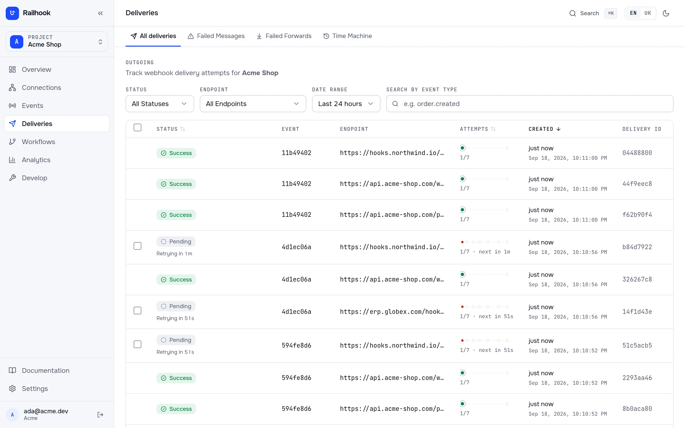
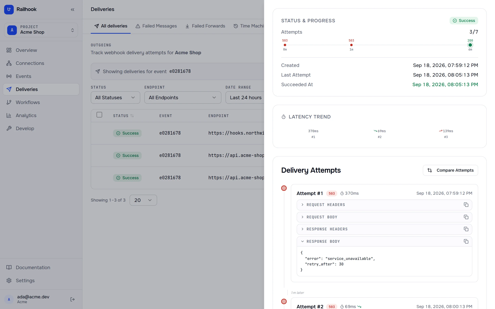
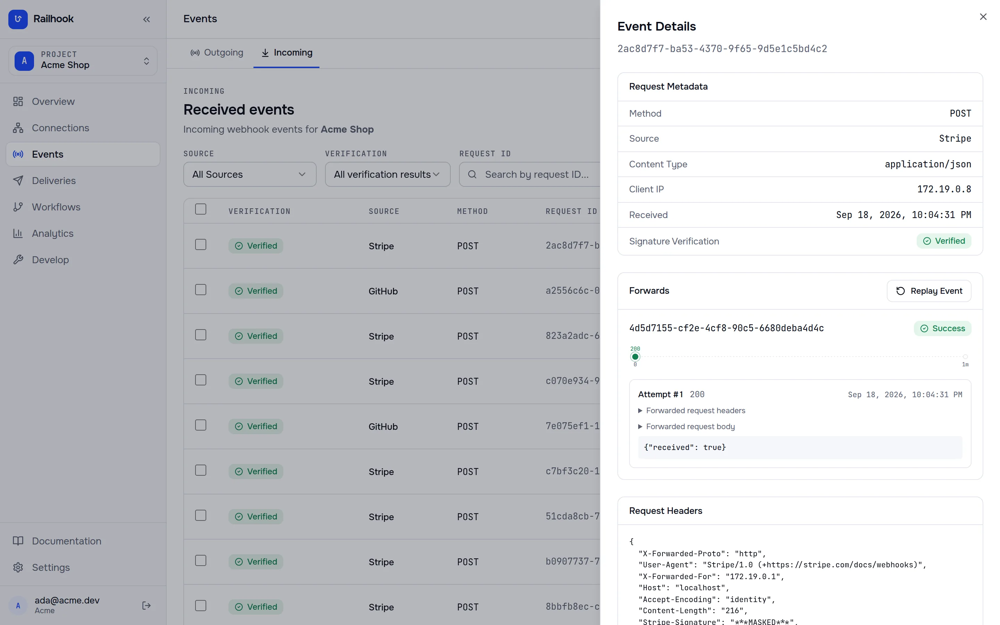

<div align="center">

<picture>
  <source media="(prefers-color-scheme: dark)" srcset="docs/brand/railhook-logo-dark.svg">
  
</picture>

**Self-hosted, open-source webhook gateway — send webhooks to your customers and receive them
from any provider, with every delivery on record.**

[](https://github.com/vadymkykalo/railhook/releases/latest)
[](https://github.com/vadymkykalo/railhook/actions/workflows/ci.yml)
[](./LICENSE)
[](https://github.com/vadymkykalo?tab=packages&repo_name=railhook)

[Website](https://railhook.io) · [Docs](https://railhook.io/docs/) ·
[API reference](https://railhook.io/docs/api-reference/) · [Railhook Cloud](https://railhook.io/register) · [Changelog](./CHANGELOG.md)






</div>

## Install

```bash
curl -fsSL https://railhook.io/install.sh | bash
```

On a server with a domain pointed at it, get HTTPS in the same step:

```bash
curl -fsSL https://railhook.io/install.sh | bash -s -- --domain hooks.example.com --email ops@example.com
```

Already running a reverse proxy? Add `--behind-proxy` instead of `--email`. Then point the proxy at `127.0.0.1:8080`.

Open **http://localhost** and register — the first account is active immediately.

- Checks the machine first: Docker with Compose v2, about 4 GiB of RAM, 5 GiB of disk, a free port.
- Writes a Compose file pinned to the latest release and a `.env` with freshly generated secrets.
- Starts everything behind one port. Day two is `./railhook status | logs | upgrade | backup | doctor`.

Rather not run it yourself? Railhook Cloud at https://railhook.io is free right now (10,000 events
a month, 3 projects, 7 days of history). Paid plans with support and higher limits will come later.

## What it does

**Outgoing** — your app announces an event; Railhook gets it to every endpoint that subscribed.

- An accepted event is never lost: it is recorded in the same transaction as your write.
- Customers verify every request — Standard Webhooks headers, with secret rotation.
- Failures retry on a schedule that runs for more than a day, then land in Failed Messages for bulk retry.
- Deliveries to one endpoint can arrive in the order the events happened.
- Time Machine replays a past range as fresh deliveries.
- Every attempt is on record with the response it got.

**Incoming** — a provider posts to a URL you own; Railhook checks it and forwards it on.

- Stripe, GitHub, GitLab, Shopify, Slack, Twilio, Square, Adyen, SendGrid and HubSpot are verified out of the box; generic HMAC covers the rest.
- Each incoming event is kept as it arrived; a provider's repeat of the same event is not forwarded twice.
- Forwards reach your destinations with their own retries and Failed Messages.

## Everything in the box

| | |
|---|---|
| **Delivery** | Retry ladder · per-endpoint ordering · rate limits · shared circuit breaker |
| **Customer portal** | Embed a portal where your own customers register endpoints, pick event types, and see and retry their deliveries — in your brand colours |
| **Recovery** | Failed Messages with bulk retry · Time Machine replay |
| **Signing** | HMAC-SHA256 in [Standard Webhooks](https://github.com/standard-webhooks/standard-webhooks) and legacy headers · secret rotation |
| **Shaping** | Rules · JSONPath transformations · schema registry · workflows · wildcard subscriptions |
| **Developing** | CLI tunnel to `localhost` · test endpoints · transformation preview · delivery dry-run · [free webhook tester](https://railhook.io/tester) |
| **AI agents** | MCP server at `/mcp` — Claude, Cursor or any MCP client can send events, manage endpoints and replay deliveries |
| **Security** | Tenant isolation · AES-256-GCM secrets at rest · SSRF protection · mTLS · PII masking · audit log |
| **Access** | Organizations and projects · Owner / Developer / Viewer roles · API keys |
| **Operating** | Prometheus metrics · Grafana dashboards · 22 alert rules · data retention · GDPR export · Helm chart |

## Architecture

```
Outgoing   your app ──▶ api ──▶ outbox (same txn) ──▶ Kafka ──▶ worker ──▶ endpoint
                                                        ▲                     │
                                                        └─── retry ladder ◀───┘
                                                        1m 5m 15m 1h 6h 24h → DLQ

Incoming   provider ──▶ /ingress/{token} ──▶ verify signature ──▶ Kafka ──▶ worker ──▶ destination
```

[`docs/ARCHITECTURE.md`](docs/ARCHITECTURE.md) covers the attempt lifecycle, Claims, ordering,
tenancy and the failure modes; [`CONTEXT.md`](CONTEXT.md) is the vocabulary it uses.

## SDKs

| Language | Install | Source |
|---|---|---|
| Node.js | `npm i @railhook/node` | [`sdks/node`](sdks/node) |
| Python | `pip install railhook` | [`sdks/python`](sdks/python) |
| PHP | `composer require railhook/php` | [`sdks/php`](sdks/php) |

Each sends events, manages endpoints and verifies signatures, authenticating with `X-API-Key`.
See [SDKs](https://railhook.io/docs/tools/sdks/).

## CLI

```bash
curl -fsSL https://railhook.io/install-cli.sh | bash
```

Receive webhooks on `localhost` while you develop — `railhook login`, then `railhook listen 3000`.
`railhook events <projectId> --follow` tails events; `railhook replay <projectId> --dry-run` previews a replay.
Install and usage: [CLI docs](https://railhook.io/docs/tools/cli/).

## AI agents (MCP)

Railhook serves the Model Context Protocol at `/mcp`, authenticated with a project API key:

```bash
claude mcp add --transport http railhook https://railhook.io/mcp \
  --header "Authorization: Bearer $RAILHOOK_API_KEY"
```

Clients that only speak stdio run `npx -y @railhook/mcp`. Setup for Cursor and Claude Desktop:
[MCP docs](https://railhook.io/docs/tools/mcp/).

## Documentation

- [Quickstart](https://railhook.io/docs/start/quickstart/)
- [Self-hosting overview](https://railhook.io/docs/self-hosting/overview/)
- [Configuration](https://railhook.io/docs/self-hosting/configuration/)
- [API reference](https://railhook.io/docs/api-reference/)

For contributors and operators: [Architecture](docs/ARCHITECTURE.md) ·
[Operations](docs/OPERATIONS.md) · [Upgrading](UPGRADING.md) · [Roadmap](ROADMAP.md) ·
[all repository docs](docs/README.md).

## Contributing

Bug reports, docs fixes and features are welcome. [`CONTRIBUTING.md`](CONTRIBUTING.md) covers setup,
the branch to target (`develop`) and the checks CI runs. Report vulnerabilities privately per
[`SECURITY.md`](SECURITY.md).

## License

[MIT](./LICENSE) © Vadym Kykalo. Self-hosted gets every feature — no licence key, no paid tier.
Third-party attributions: [`NOTICE`](./NOTICE), [`docs/licenses/`](docs/licenses/).
