# Architecture

Terms (Event, Delivery, Forward, Claim, Attempt, Deferral) are defined in
[`CONTEXT.md`](../CONTEXT.md).

Railhook moves traffic in two directions. Outgoing, it sends the customer's Events and signs
them. Incoming, it receives providers' webhooks and verifies them. Both use one attempt
lifecycle; ladders, ordering and failure handling differ.

## The two directions

### Outgoing: the customer's own Event travels out

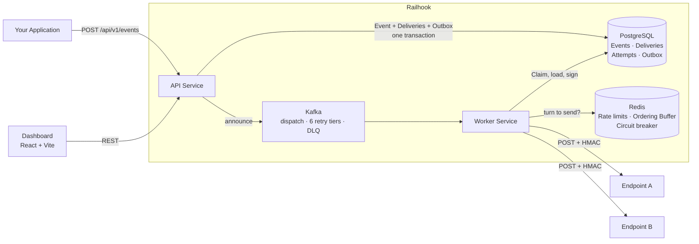

### Incoming: a provider's webhook travels in

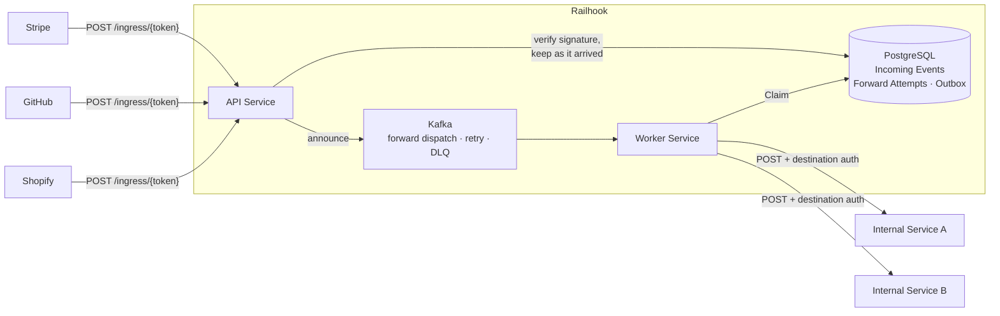

Incoming has no Ordering Buffer (Railhook cannot know the provider's intended order) and a
shorter Retry Ladder.

## Services

| Service | Port | Role |
|---------|------|------|
| **API** | `8080` | Event ingestion, webhook ingress, REST API, Outbox announcer |
| **Worker** | `8081` | Kafka consumer, HTTP delivery, forwarding, retry scheduling |
| **UI** | `5173` | Admin dashboard (React / Vite / shadcn/ui) |
| **PostgreSQL** | `5432` | Events, Deliveries, Incoming Events, Attempts, Outbox |
| **Kafka** | `9092` | Dispatch + 6 retry tiers + forward dispatch/retry + DLQ |
| **Redis** | `6379` | Rate limiting, FIFO ordering, circuit breaker |

## Data model

Delivery-path tables only. `deliveries` is to `events` what `incoming_forward_attempts` is to
`incoming_events`.

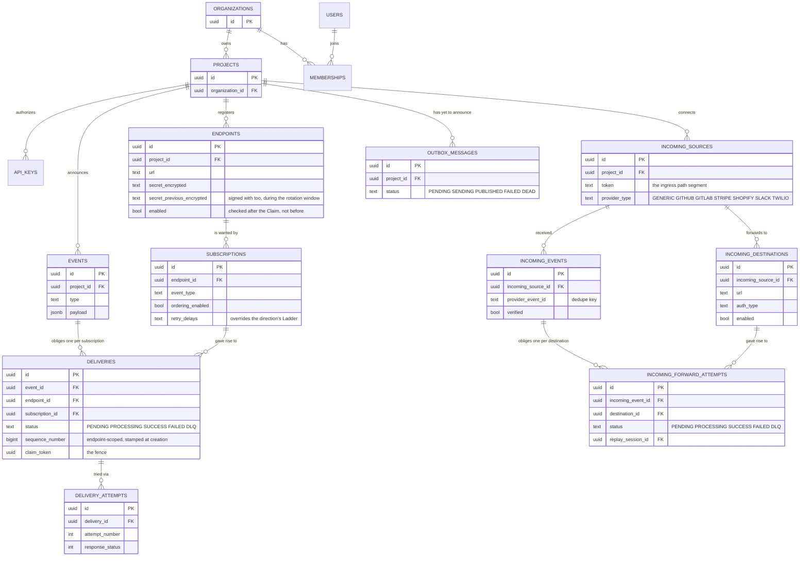

Every table except `users` has an `organization_id`, applied by Hibernate, never written by hand.
See [Tenancy](#tenancy).

## Outgoing delivery flow

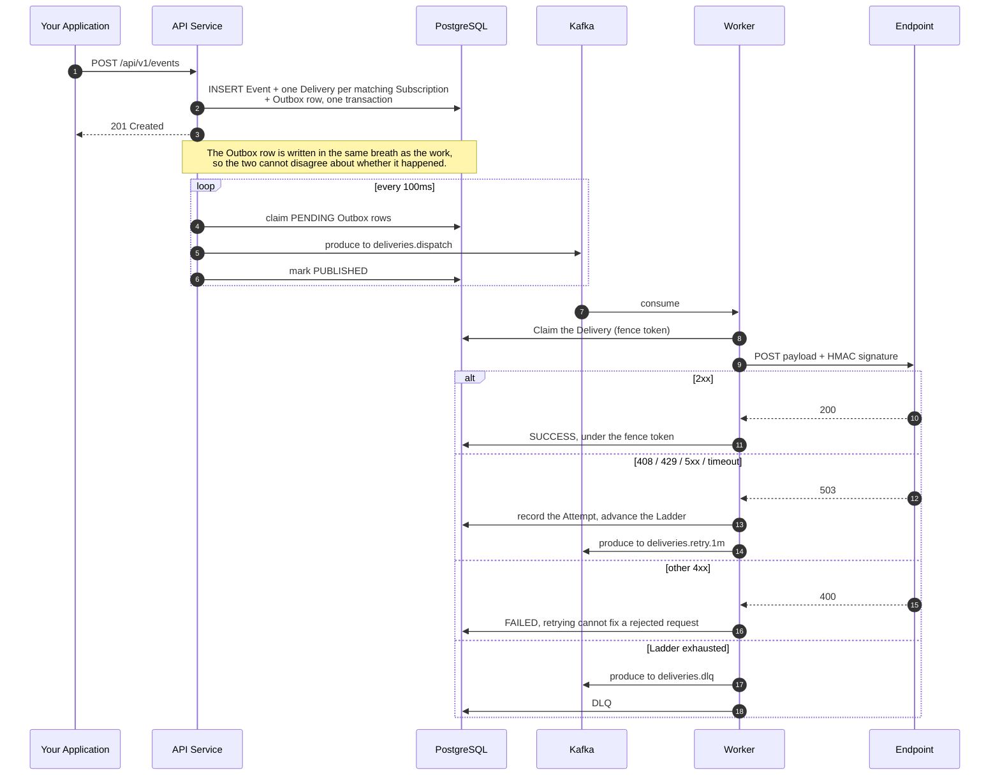

Each retry tier is its own Kafka topic (`deliveries.retry.1m`, `.5m`, `.15m`, `.1h`, `.6h`,
`.24h`), because a sleeping consumer would hold a partition.

## Incoming ingress flow

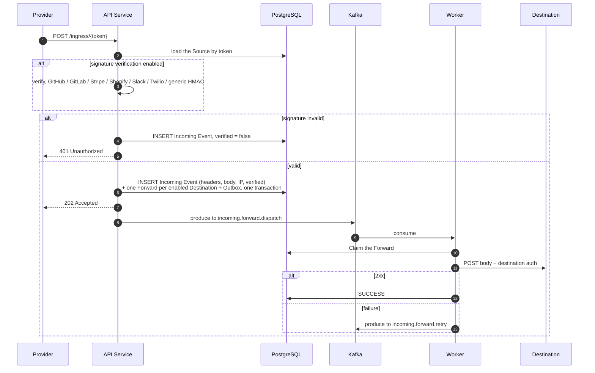

The Incoming Event is stored before verification, and kept if it fails, so an operator can see
the rejected request.

## The attempt lifecycle

Both directions run `AttemptRunner`, with one `AttemptStore` per direction. The Claim is a type
parameter, so the Runner cannot read a fence token. Read the Runner's javadoc (five invariants)
before changing anything here.

### Claim and fence

A Claim is exclusive, revocable ownership of one Delivery or Forward for one Attempt. A write
only lands if the fence token still matches, so a worker that lost its Claim cannot overwrite the
outcome.

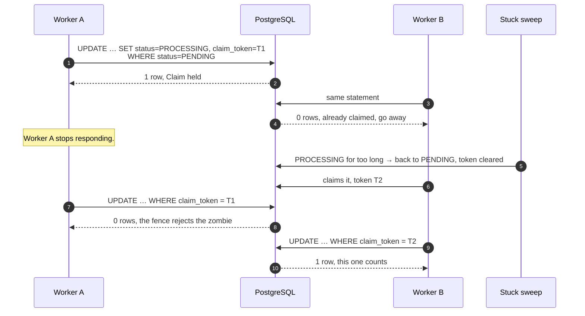

### Admission, and what a Deferral is

After the Claim, five limits are checked in order. Failing any of them is a **Deferral**: nothing
was sent, so the Ladder does not advance.

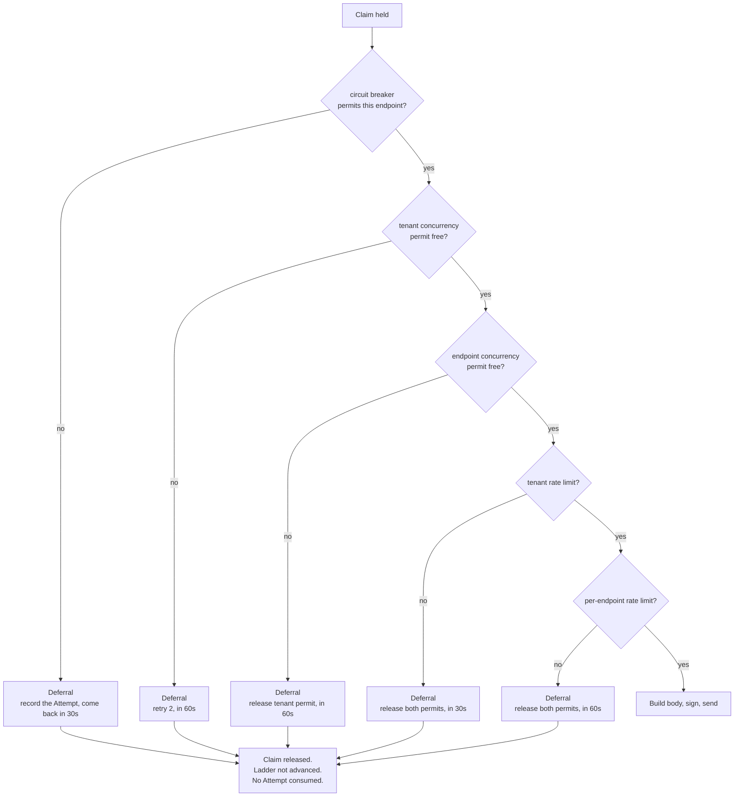

Every path that takes a permit releases it. The breaker is the one Deferral that records an
Attempt (`CIRCUIT_BREAKER_OPEN`), so an operator sees why the endpoint went quiet.

### Delivery and Forward states

Same states on both sides: `PENDING`, `PROCESSING`, `SUCCESS`, `FAILED`, `DLQ`.

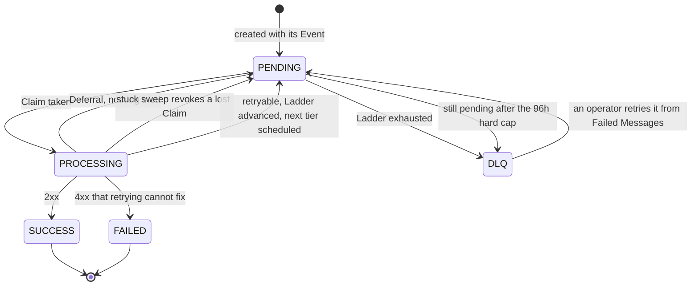

- `PROCESSING -> PENDING` has three causes: a Deferral, a revoked Claim, a retry. Only a retry
  advances the Ladder.
- `PENDING -> DLQ`: the Ladder ran out, or `StaleDeliveryEscalationService` hit the hard cap
  (default 96h, above the ladder's ~83h worst case). Alert on
  `delivery_oldest_pending_age_seconds`.
- `PENDING -> DLQ` also happens when Railhook auto-disables a target after a window of only
  failures (`EndpointAutoDisableService`, fed by `AttemptStore#recordTargetOutcome`). If the
  owner disabled the target, its queued work ends `FAILED` instead.
- `DLQ -> PENDING` is a human decision, from **Failed Messages** in the UI.

### The two ladders

Declared once, in `RetryLadderDefaults`. No fallback ladder. A Subscription or Destination may
override delays, attempt count and retryable statuses (`RetryableStatuses`, default
`408,429,500-599`).

`Retry-After` on a 429 or 503 can push one Attempt later, never earlier, capped by
`WEBHOOK_RETRY_AFTER_MAX_SECONDS` (6h).

| | Outgoing | Incoming |
|---|---|---|
| Delays | 1m · 5m · 15m · 1h · 6h · 24h | 1m · 5m · 15m · 1h · 6h |
| Attempts | 7 | 5 |
| Waits used | all six, ~31h21m first to last | the first four, ~1h21m first to last; the 6h tier is reached only if a Destination raises its attempts |

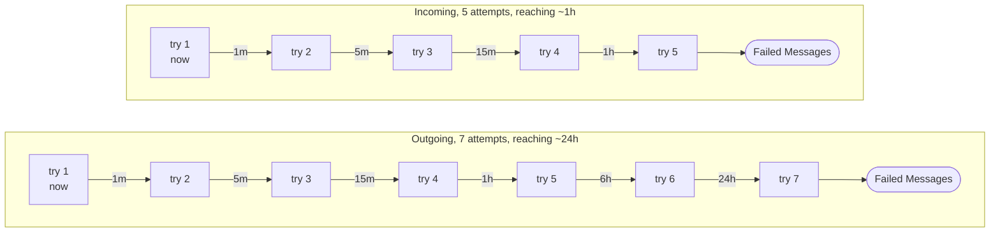

They differ on purpose. Do not make them agree.

`RetryPolicy` (exponential backoff, 25% jitter) is only for rescheduling a Deferral, never a
failed Attempt.

## Ordering

Outgoing only, opt-in per Subscription. Each Delivery gets an endpoint-scoped Sequence Number at
creation. A Delivery whose predecessors have not resolved waits in the Ordering Buffer.

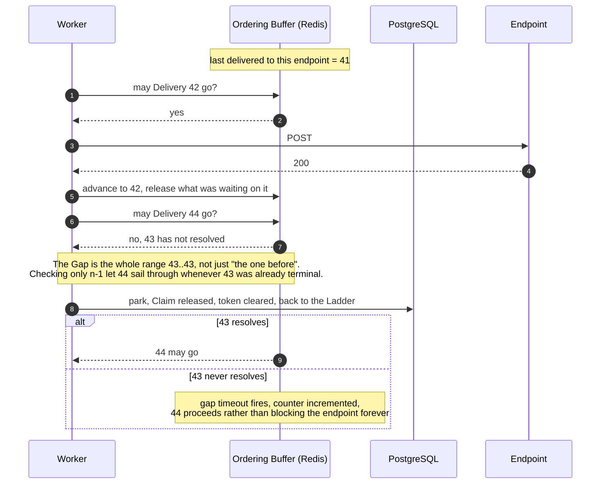

Parking releases the Claim and clears the fence token. Drain speed of a parked burst depends on
the retry scheduler's poll cadence, not the buffer's delay.

## Replay is not retry

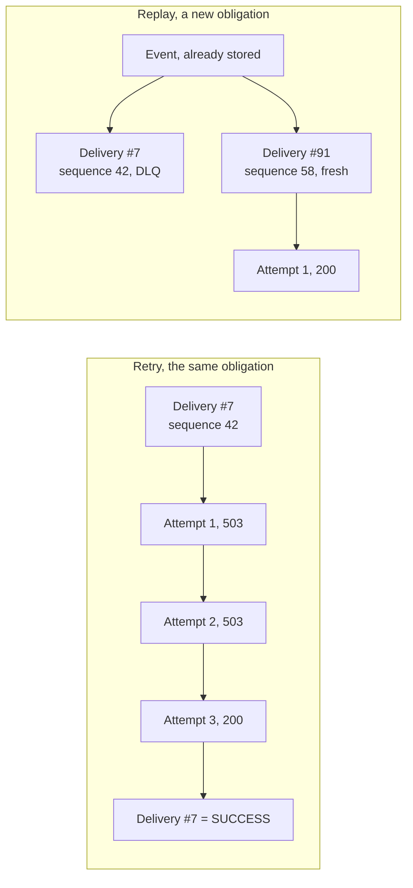

A retry is the next Attempt on the same Delivery and advances its Ladder. A replay (UI: **Time
Machine**, recorded as a `ReplaySession`) creates a new Delivery from the stored Event with a new
Sequence Number, so it goes to the end of the endpoint's order.

## Tenancy

Scoping to an Organization is a Hibernate `@TenantId` on about 35 entities, resolved per request.

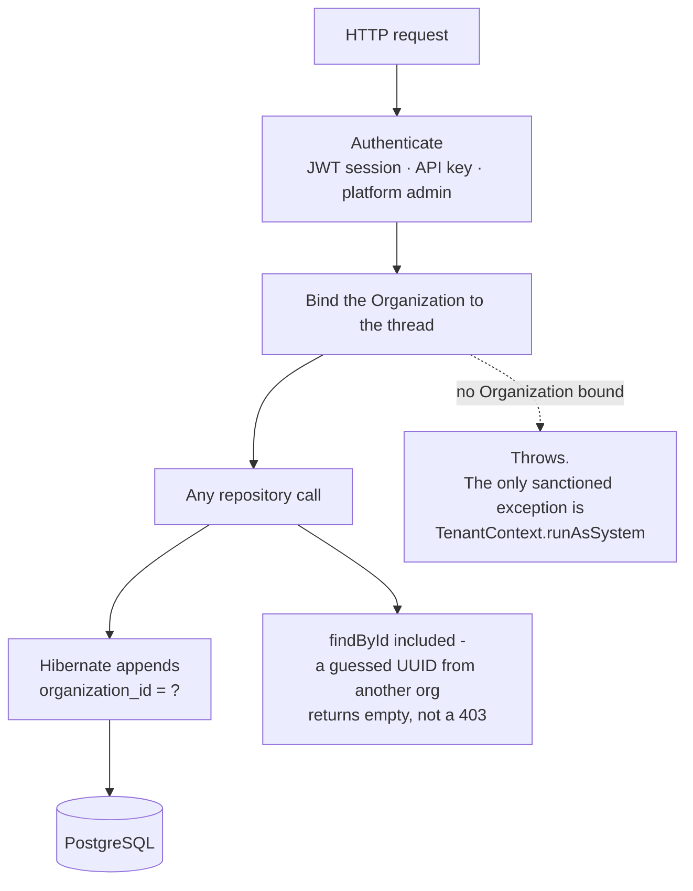

**Never hand-roll an org check.** A service method taking an `organizationId` fails the build.
`@TenantId` does not cover work without a request (enter a scope explicitly, outside the
transaction), native queries, or your own thread pools. The ratchets check these.

## Consistency, partitioning and failure modes

### What is guaranteed

- **At-least-once delivery.** An Attempt can succeed at the endpoint and fail to record, so the
  endpoint may see it twice. The `webhook-id` header is the Delivery id and stays the same across
  Attempts; receivers dedupe on it.
- **The Outbox makes acceptance and announcement agree.** Event, Deliveries and Outbox row are
  one transaction. If Kafka is down, delivery is late, not lost.
- **Ordering is per endpoint, opt-in, outgoing only.** Off by default.

### Partitioning

Kafka messages are keyed by endpoint, so one hot endpoint is limited to one consumer.
`delivery_attempts` and `tunnel_request_log` are time-partitioned in Postgres, so retention is a
partition detach.

### Failure modes worth knowing

| What breaks | What happens | Where to look |
|---|---|---|
| **Redis unreachable** | The circuit breaker fails open: calls are allowed and counted. | `circuit_breaker_degraded_total` |
| **An endpoint is degraded for days** | The Ladder runs out; anything `PENDING` past the hard cap goes to Failed Messages. | `delivery_oldest_pending_age_seconds` |
| **Retry storm after a mass outage** | `RetryGovernor` applies AIMD to the scheduler batch size, a queue-depth gate and a failure cooldown. | governor gauges |
| **A worker dies mid-Attempt** | The stuck sweep revokes the Claim; the fence blocks the late write. The endpoint may see a duplicate. | at-least-once, above |
| **Kafka consumer lag** | Deliveries are late, not lost. | consumer lag dashboard |
| **A transformation template breaks** | Retryable; the raw payload is never sent instead. | invariant 4 |
| **Postgres restored from backup** | Postgres, Kafka and Redis disagree. Flush Redis, leave Kafka, let the stuck sweep re-queue. | [OPERATIONS.md](./OPERATIONS.md#disaster-recovery) |

### Scaling limits

API and worker are stateless and have an HPA in the chart. Limits, in the order usually hit:
Postgres writes on `delivery_attempts`, partition count for one hot endpoint, Redis round-trips
per Attempt on the ordering path.

## Production topology

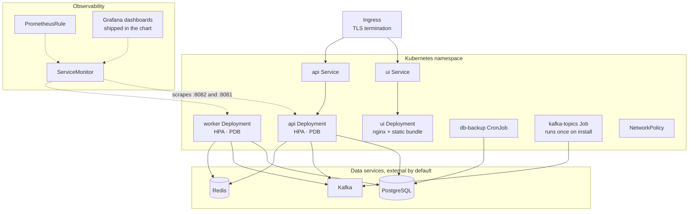

The chart ships no database. Postgres, Kafka and Redis are external.

## CLI tunnel flow

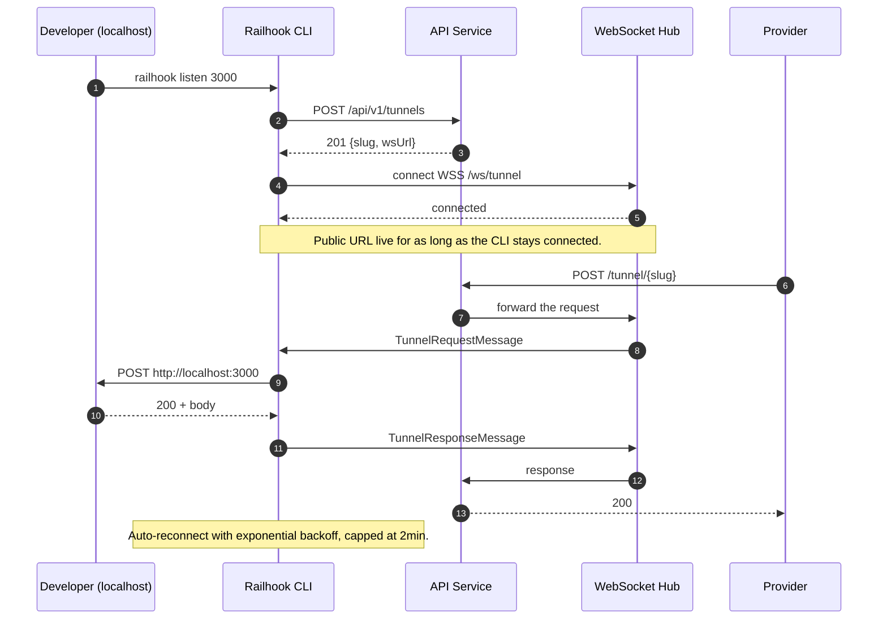
